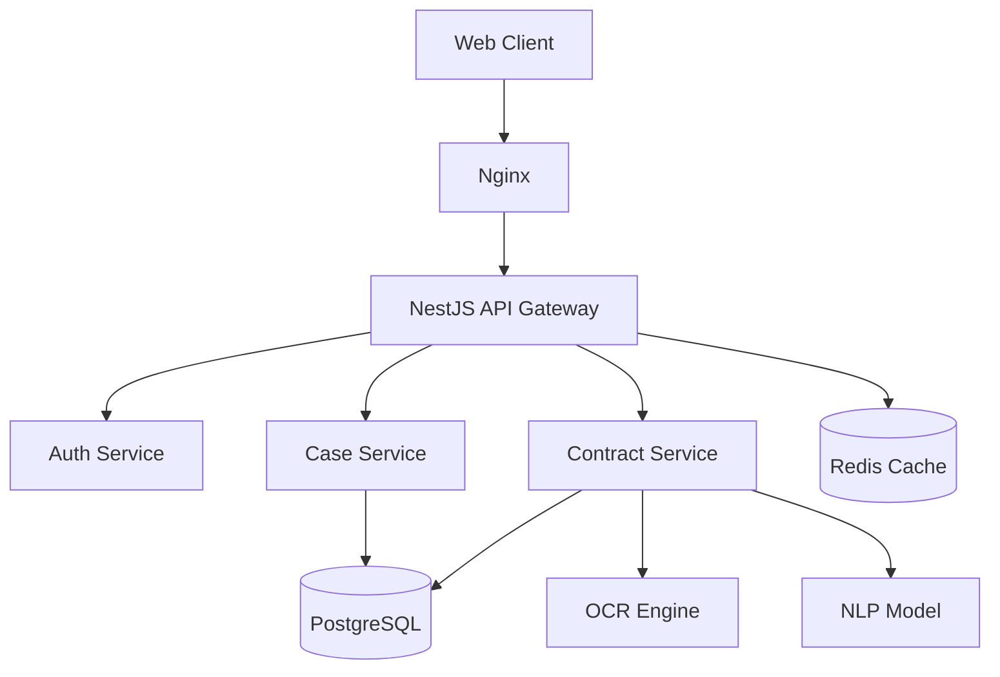

# 部署与运维指南

本文档适用于系统管理员和运维工程师，介绍智慧法务系统的私有化部署与日常运维流程。

## 1. 环境要求

| 组件 | 版本要求 | 说明 |
| :--- | :--- | :--- |
| OS | Linux (CentOS 7+ / Ubuntu 20.04+) | 推荐内核版本 4.19+ |
| CPU | 8 Core + | 建议 AVX2 指令集支持（用于 AI 模型推理） |
| RAM | 32 GB + | 推荐 64 GB |
| Docker | 20.10+ | 容器化运行环境 |
| Node.js | 18.x | 前端构建依赖 |

## 2. 快速部署 (Docker Compose)

我们提供了标准化的 `docker-compose.yml` 文件，可一键拉起所有服务。

```bash
# 1. 下载部署包
git clone https://github.com/smart-legal/deploy.git
cd deploy

# 2. 配置环境变量
cp .env.example .env
vim .env  # 修改数据库密码、Redis地址等

# 3. 启动服务
docker-compose up -d
```

## 3. 服务架构



## 4. 备份策略

*   **数据库备份**：每日凌晨 02:00 自动执行全量备份，保留近 7 天数据。
*   **文件备份**：合同文件存储在 MinIO/OSS，需配置跨区域复制或定期冷备。

## 5. 监控告警

系统集成了 Prometheus + Grafana 监控方案。
*   **监控指标**：CPU/内存使用率、API 响应时间、错误率、AI 推理延迟。
*   **告警渠道**：支持邮件、钉钉、企业微信机器人。
