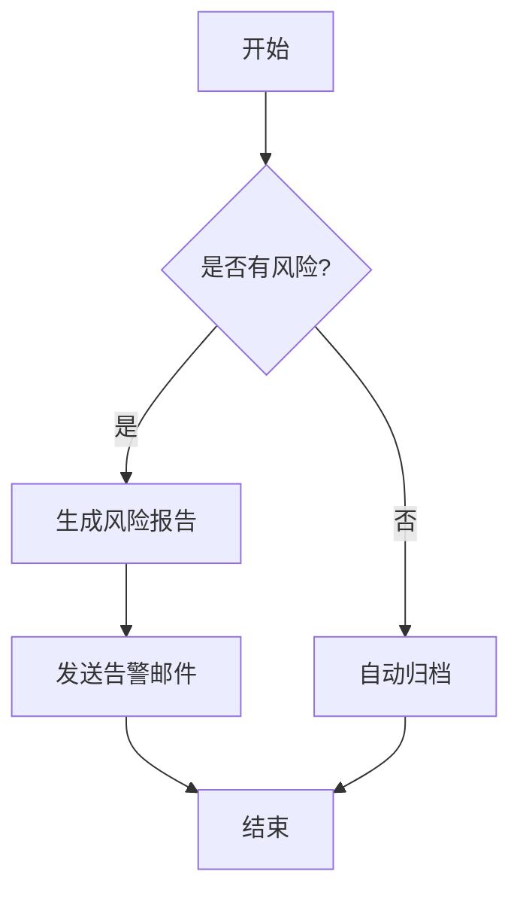
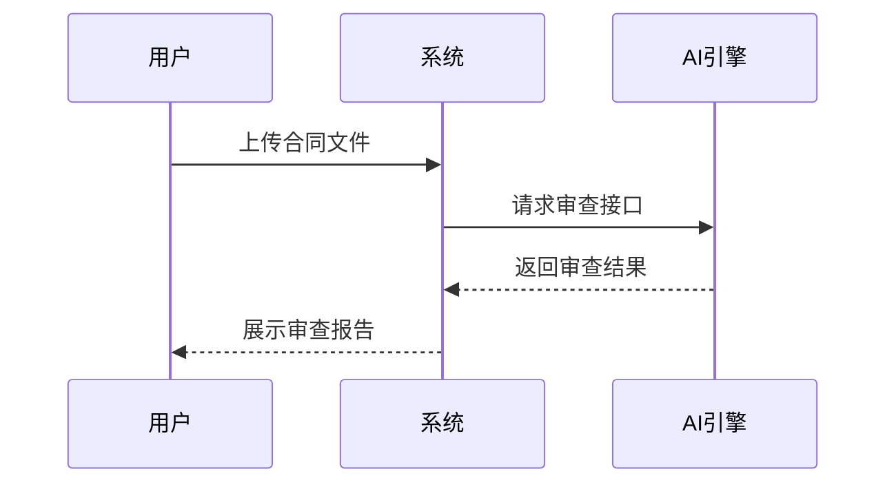
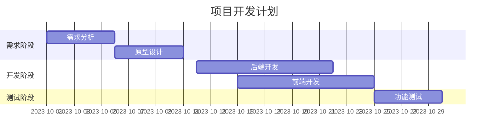
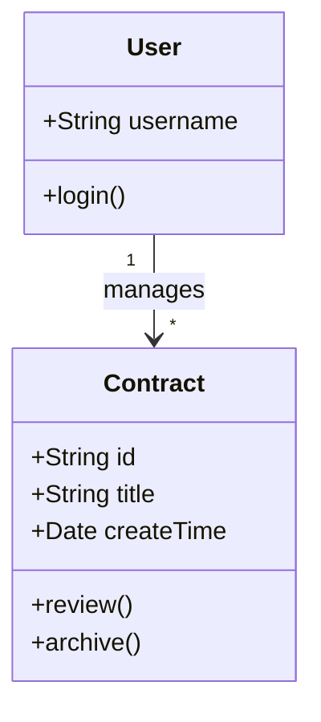

# Markdown 综合示例

本文档展示了当前系统支持的所有 Markdown 语法效果，包括基础文本格式、代码高亮、表格、数学公式以及 Mermaid 图表等。

## 1. 基础文本格式

**加粗文本**，*斜体文本*，~~删除线文本~~，`行内代码`。

> 这是一段引用文本。
>
> 支持多行引用。

### 列表

**无序列表**：
*   项目 A
*   项目 B
    *   子项目 B-1
    *   子项目 B-2

**有序列表**：
1.  第一步
2.  第二步
3.  第三步

### 任务列表

- [x] 已完成任务
- [ ] 未完成任务
- [ ] 待办事项

---

## 2. 表格 (Table)

| 姓名 | 职位 | 部门 | 状态 |
| :--- | :--- | :--- | :---: |
| 张三 | 高级律师 | 诉讼部 | 在职 |
| 李四 | 法务专员 | 合规部 | 休假 |
| 王五 | 实习生 | 知识产权部 | 离职 |

## 3. 代码高亮 (Code Highlight)

### JavaScript/TypeScript

```typescript
interface User {
  id: number;
  name: string;
  role: 'admin' | 'user';
}

function getUserInfo(user: User): string {
  return `User ${user.name} is a ${user.role}`;
}

const admin: User = { id: 1, name: 'Alice', role: 'admin' };
console.log(getUserInfo(admin));
```

### Python

```python
def fibonacci(n):
    if n <= 0:
        return []
    elif n == 1:
        return [0]
    
    sequence = [0, 1]
    while len(sequence) < n:
        sequence.append(sequence[-1] + sequence[-2])
    return sequence

print(fibonacci(10))
```

### JSON

```json
{
  "project": "Smart Legal Demo",
  "version": "1.0.0",
  "features": ["AI Review", "Case Management", "Risk Monitor"]
}
```

## 4. 数学公式 (Math)

支持 LaTeX 语法，由 KaTeX 渲染。

**行内公式**：质能方程 $E = mc^2$ 是物理学中最著名的公式之一。

**块级公式**：

$$
f(x) = \int_{-\infty}^\infty \hat f(\xi)\,e^{2\pi i \xi x} \,d\xi
$$

矩阵示例：

$$
\begin{pmatrix}
a & b \\
c & d
\end{pmatrix}
\times
\begin{pmatrix}
x \\
y
\end{pmatrix}
=
\begin{pmatrix}
ax + by \\
cx + dy
\end{pmatrix}
$$

## 5. Mermaid 图表

### 流程图 (Flowchart)



### 时序图 (Sequence Diagram)



### 甘特图 (Gantt Chart)



### 类图 (Class Diagram)



## 6. HTML 混合 (Raw HTML)

<div style="padding: 15px; background-color: #f0f9ff; border-left: 4px solid #0ea5e9; border-radius: 4px; color: #0c4a6e;">
  <strong>提示：</strong> Markdown 中可以直接嵌入 HTML 标签来实现更丰富的样式。
</div>

<br/>

<details>
<summary>点击展开详情</summary>
<p>这里是折叠的内容。利用 HTML 的 details 和 summary 标签可以实现折叠效果，非常适合放置长代码或补充说明。</p>
</details>
